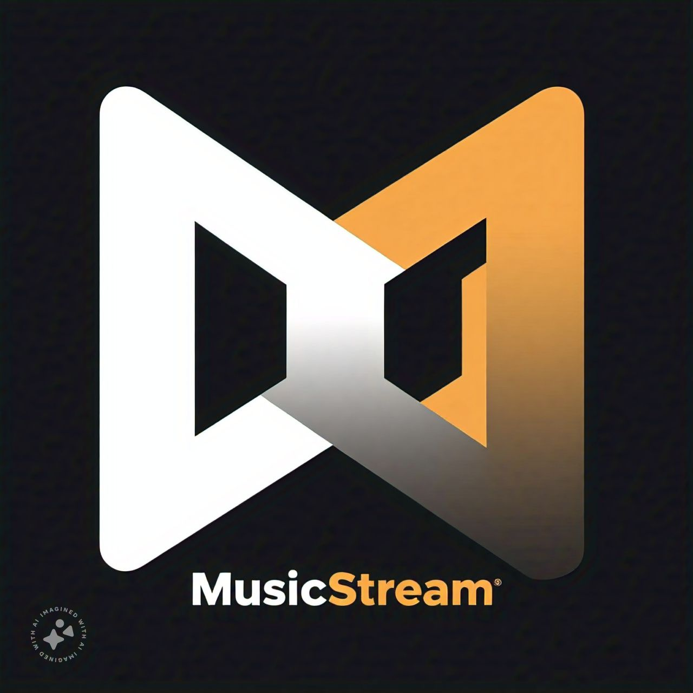

# MusicStream - Modern Streaming Platform

A sleek and modern music streaming platform built with React and Tailwind CSS, featuring a responsive design, interactive audio player, and seamless user experience.



## 🎵 Features

### Dynamic Audio Player
- Global audio state management
- Real-time progress tracking
- Volume control with mute toggle
- Playlist continuity
- Animated music visualizer
- Responsive controls

### Intuitive Library Management
- Create and manage playlists
- Grid-style playlist view
- Quick play functionality
- Drag-and-drop support
- Detailed playlist views
- Track information display

### Smart Explore Section
- Real-time search functionality
- Advanced filtering options
- Genre and mood-based discovery
- Trending tracks showcase
- Animated search results
- Responsive grid layout

### Personalized User Profiles
- User statistics dashboard
- Recently played tracks
- Custom preferences
- Notification settings
- Interactive UI elements
- Profile customization

### Modern UI/UX
- Responsive design for all devices
- Smooth animations and transitions
- Dark mode optimization
- Interactive hover effects
- Custom scrollbar styling
- Loading state animations

## 🛠️ Technology Stack

- **Frontend Framework**: React
- **Styling**: Tailwind CSS
- **Animations**: Framer Motion
- **Routing**: React Router DOM
- **State Management**: React Context
- **Icons**: React Icons
- **Audio Handling**: HTML5 Audio API

## 🚀 Getting Started

1. **Clone the repository**
   ```bash
   git clone https://github.com/Sanmoy1/streaming_platform.git
   cd streaming_platform
   ```

2. **Install dependencies**
   ```bash
   npm install
   ```

3. **Start the development server**
   ```bash
   npm start
   ```

4. **Open your browser**
   Visit [http://localhost:3000](http://localhost:3000)

## 📱 Responsive Design

- Mobile-first approach
- Breakpoint optimizations
- Touch-friendly controls
- Adaptive layouts
- Consistent experience across devices

## 🎨 Design System

### Typography
- Headings: Inter
- Body: Roboto
- Special Text: Poppins

### Components
- Modern card designs
- Glass morphism effects
- Gradient overlays
- Consistent spacing
- Interactive elements

## 🔄 Project Structure

```
src/
├── components/
│   ├── layout/
│   ├── library/
│   ├── explore/
│   └── common/
├── pages/
├── context/
├── data/
└── utils/
```

## 🎯 Future Enhancements

1. Collaborative Playlists
2. Social Features
3. Advanced Audio Features


## 📄 Available Scripts

- `npm start`: Run development server
- `npm test`: Launch test runner
- `npm run build`: Build for production
- `npm run eject`: Eject from Create React App

## 🤝 Contributing

Feel free to contribute to this project by submitting issues or pull requests. Please follow the existing code style and include appropriate tests.

